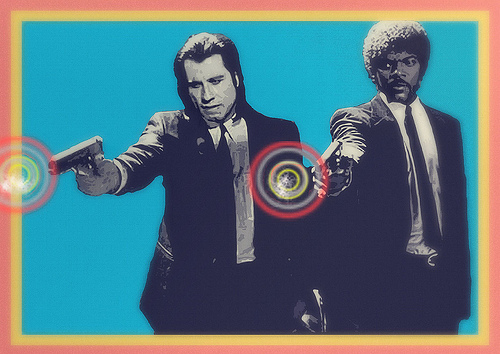

Lorem Ipsum
===========
Samuel L. Ipsum <samuel@slipsum.com>

== Ezekiel 25 17 

[role="center"]

The path of the righteous man is beset on all sides by the iniquities of the selfish and the tyranny of evil men. Blessed is he who, in the name of charity and good will, shepherds the weak through the valley of darkness, for he is truly his brother's keeper and the finder of lost children. And I will strike down upon thee with great vengeance and furious anger those who would attempt to poison and destroy My brothers. And you will know My name is the Lord when I lay My vengeance upon thee.

Now that there is the Tec-9, a crappy spray gun from South Miami. This gun is advertised as the most popular gun in American crime. Do you believe that shit? It actually says that in the little book that comes with it: the most popular gun in American crime. Like they're actually proud of that shit. 

The path of the righteous man is beset on all sides by the iniquities of the selfish and the tyranny of evil men. Blessed is he who, in the name of charity and good will, shepherds the weak through the valley of darkness, for he is truly his brother's keeper and the finder of lost children. And I will strike down upon thee with great vengeance and furious anger those who would attempt to poison and destroy My brothers. And you will know My name is the Lord when I lay My vengeance upon thee.

Normally, both your asses would be dead as fucking fried chicken, but you happen to pull this shit while I'm in a transitional period so I don't wanna kill you, I wanna help you. But I can't give you this case, it don't belong to me. Besides, I've already been through too much shit this morning over this case to hand it over to your dumb ass.

You think water moves fast? You should see ice. It moves like it has a mind. Like it knows it killed the world once and got a taste for murder. After the avalanche, it took us a week to climb out. Now, I don't know exactly when we turned on each other, but I know that seven of us survived the slide... and only five made it out. Now we took an oath, that I'm breaking now. We said we'd say it was the snow that killed the other two, but it wasn't. Nature is lethal but it doesn't hold a candle to man.

Image credit: http:http://www.flickr.com/photos/33313181@N02/[Cassius Cassini]

== Z is dead baby

Your bones don't break, mine do. That's clear. Your cells react to bacteria and viruses differently than mine. You don't get sick, I do. That's also clear. But for some reason, you and I react the exact same way to water. We swallow it too fast, we choke. We get some in our lungs, we drown. However unreal it may seem, we are connected, you and I. We're on the same curve, just on opposite ends.

You think water moves fast? You should see ice. It moves like it has a mind. Like it knows it killed the world once and got a taste for murder. After the avalanche, it took us a week to climb out. Now, I don't know exactly when we turned on each other, but I know that seven of us survived the slide... and only five made it out. Now we took an oath, that I'm breaking now. We said we'd say it was the snow that killed the other two, but it wasn't. Nature is lethal but it doesn't hold a candle to man.

Now that there is the Tec-9, a crappy spray gun from South Miami. This gun is advertised as the most popular gun in American crime. Do you believe that shit? It actually says that in the little book that comes with it: the most popular gun in American crime. Like they're actually proud of that shit. 

== Vincent Vega

Well, the way they make shows is, they make one show. That show's called a pilot. Then they show that show to the people who make shows, and on the strength of that one show they decide if they're going to make more shows. Some pilots get picked and become television programs. Some don't, become nothing. She starred in one of the ones that became nothing.

You think water moves fast? You should see ice. It moves like it has a mind. Like it knows it killed the world once and got a taste for murder. After the avalanche, it took us a week to climb out. Now, I don't know exactly when we turned on each other, but I know that seven of us survived the slide... and only five made it out. Now we took an oath, that I'm breaking now. We said we'd say it was the snow that killed the other two, but it wasn't. Nature is lethal but it doesn't hold a candle to man.

// .Texts credits
[abstract]
--

The textual content of this document has been automatically generated thanks to http://slipsum.com 

--
